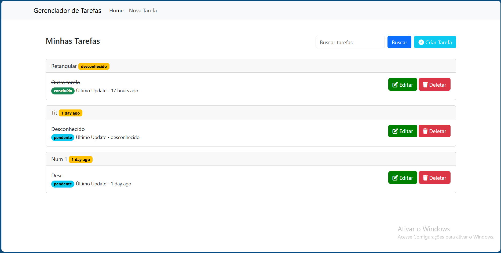

# Sistema de Gerenciamento de Tarefas

Este é um sistema simples de gerenciamento de tarefas desenvolvido usando Laravel 9, PHP, MySQL e HTML/CSS.

## Funcionalidades

- **Listar Tarefas**: Exibe todas as tarefas cadastradas.
- **Adicionar Tarefa**: Permite a criação de novas tarefas.
- **Editar Tarefa**: Edita tarefas já existentes.
- **Marcar como Concluída**: Muda o status da tarefa para concluída.
- **Excluir Tarefa**: Exclui tarefas cadastradas.

## Tecnologias Utilizadas

- **Back-end**: PHP, Laravel 9
- **Front-end**: HTML, CSS
- **Banco de Dados**: MySQL

## Instalação

### Pré-requisitos

- PHP >= 8.0
- Composer
- MySQL


### Passos para Instalação

1. Clone o repositório e mude para o diretório do projeto, ZeniteCRUD.

```bash
git clone https://github.com/walminho/ZeniteCRUD
cd ZeniteCRUD
```
2. Istalar o composer

```bash
composer install
```

3. Renomeie o arquivo **.env.example**:

```bash
mv .env.example .env
```

4. Crie a app key (chave da aplicação) utilisando o artisan.

    ```php artisan key:generate```

Após isso, a aplicação deve funcionar e mostrar algo como a imagem a seguir.


